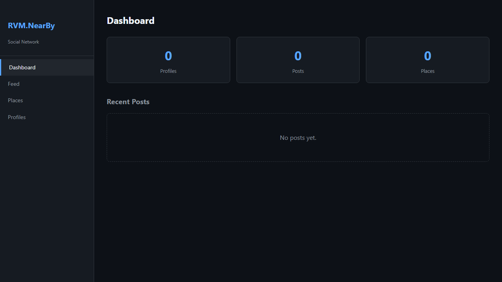
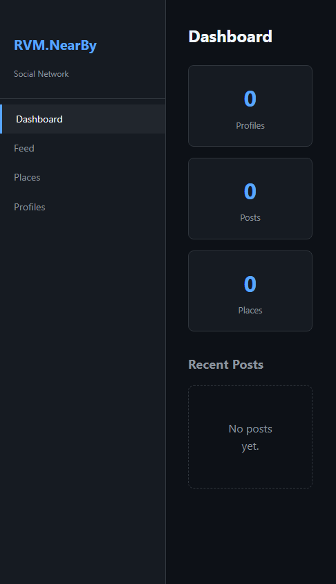
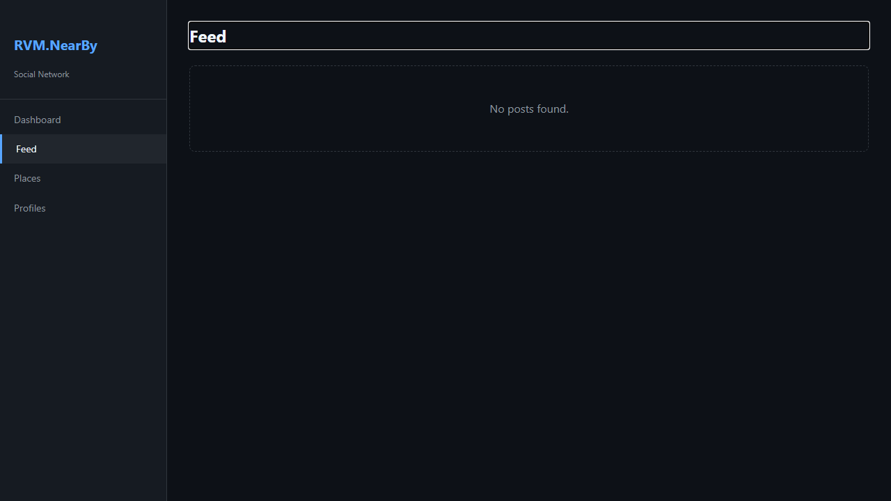
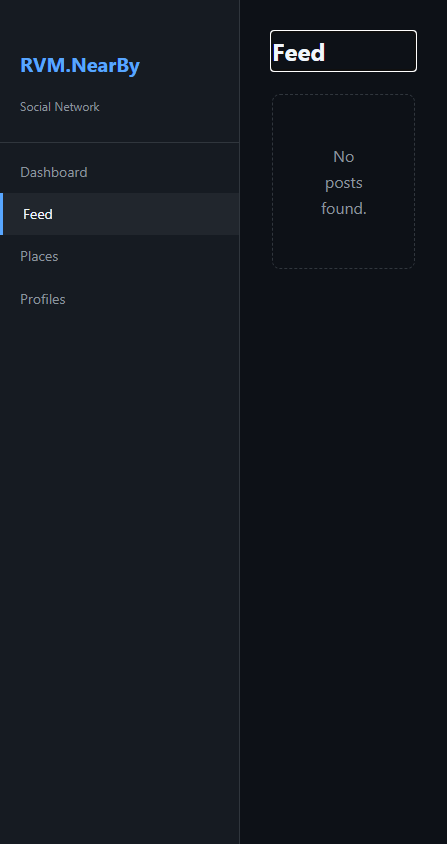
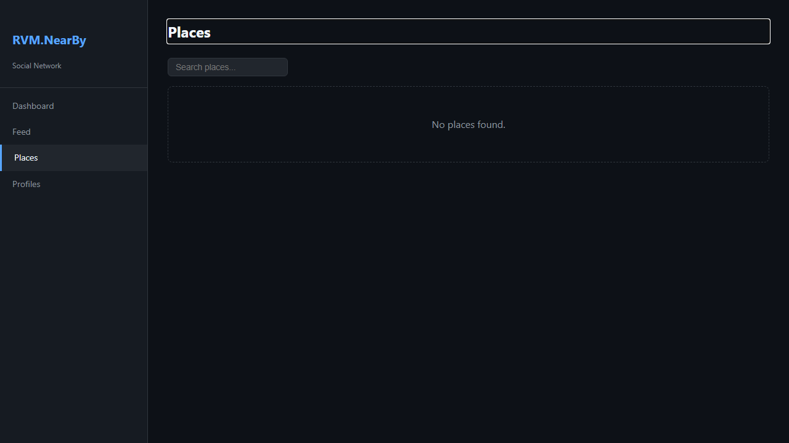
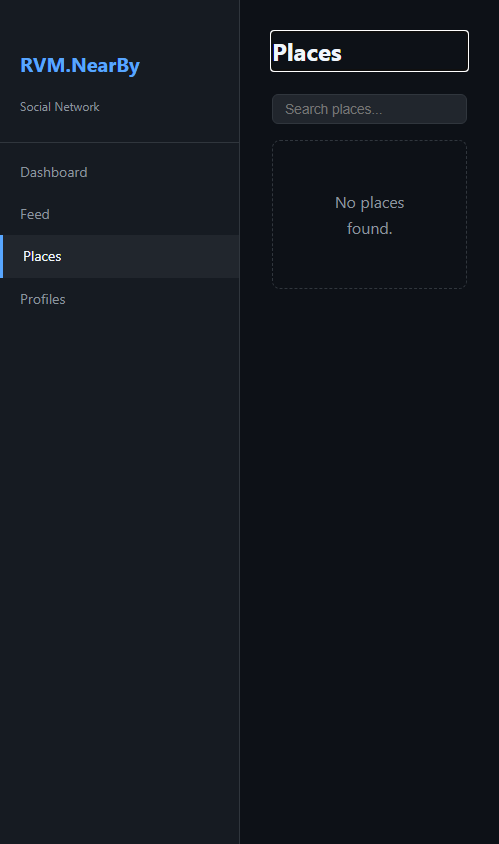
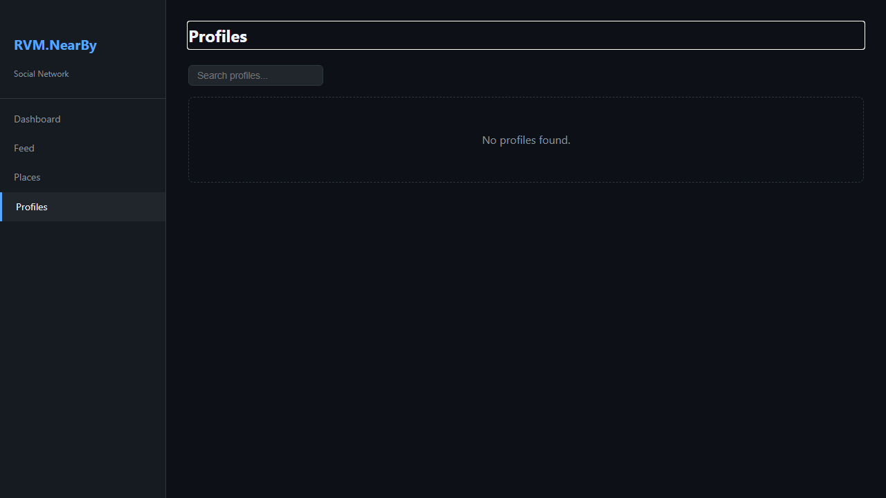
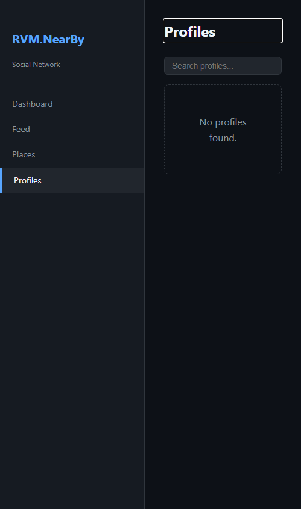

# RVM.NearBy - Manual do Usuario

> Rede Social por Geolocalizacao — Guia Completo de Funcionalidades
>
> Gerado em 26/04/2026 | RVM Tech

---

## Visao Geral

O **RVM.NearBy** e uma rede social baseada em geolocalizacao.
Descubra o que esta acontecendo perto de voce: posts, check-ins, eventos e lugares
compartilhados por pessoas na sua regiao.

**Recursos principais:**
- **Feed local** — publicacoes e eventos proximos em tempo real
- **Mapa interativo** — visualize posts e lugares no mapa
- **Places** — descubra e avalie lugares na sua cidade
- **Check-in** — compartilhe sua visita a lugares
- **Perfis** — conecte-se com pessoas da sua regiao
- **PostGIS** — busca geografica precisa com raio configuravel

---

## 1. Dashboard / Home

Pagina inicial do RVM.NearBy. Apresenta um resumo da atividade proxima ao usuario: posts recentes, lugares populares e perfis sugeridos na regiao.

**Funcionalidades:**
- Resumo de atividade local recente
- Posts e eventos proximos em destaque
- Lugares mais populares na area
- Sugestoes de perfis para seguir
- Indicadores de distancia em tempo real

> **Dicas:**
> - A localizacao e usada para personalizar o conteudo exibido.
> - Atualize a pagina para ver o conteudo mais recente da sua regiao.

| Desktop | Mobile |
|---------|--------|
|  |  |

---

## 2. Feed de Publicacoes

Feed cronologico de publicacoes dos usuarios e lugares proximos. Veja fotos, textos, check-ins e eventos compartilhados na sua regiao.

**Funcionalidades:**
- Posts de usuarios proximos em ordem cronologica
- Fotos, textos e check-ins de lugares
- Curtir e comentar publicacoes
- Filtrar por tipo de conteudo (fotos, eventos, check-ins)
- Distancia do autor em relacao a sua posicao
- Carregar mais publicacoes ao rolar a pagina

> **Dicas:**
> - Use os filtros para ver apenas o tipo de conteudo que interessa.
> - Publicacoes mais proximas aparecem primeiro no feed.

| Desktop | Mobile |
|---------|--------|
|  |  |

---

## 3. Lugares (Places)

Descubra e explore lugares cadastrados na plataforma: restaurantes, cafes, parques, comercios e pontos turisticos. Veja avaliacao, fotos e check-ins de cada lugar.

**Funcionalidades:**
- Listagem de lugares proximos com distancia
- Categorias: Restaurantes, Cafes, Comercio, Lazer, Cultura
- Avaliacao media e numero de visitas
- Fotos enviadas por usuarios
- Botao para fazer check-in
- Mapa com localizacao dos lugares
- Busca por nome ou categoria

> **Dicas:**
> - Faca check-in em lugares para compartilhar sua visita com seguidores.
> - Avalie os lugares que voce visita para ajudar outros usuarios.

| Desktop | Mobile |
|---------|--------|
|  |  |

---

## 4. Perfis de Usuarios

Explore e conecte-se com usuarios proximos. Veja o perfil publico, publicacoes, lugares visitados e interesses em comum.

**Funcionalidades:**
- Listagem de usuarios ativos na sua area
- Foto de perfil, nome e distancia aproximada
- Publicacoes e check-ins publicos do usuario
- Seguir/deixar de seguir usuarios
- Interesses e categorias preferidas
- Busca por nome de usuario

> **Dicas:**
> - Siga usuarios com interesses em comum para personalizar seu feed.
> - A distancia mostrada e aproximada e preserva a privacidade do usuario.

| Desktop | Mobile |
|---------|--------|
|  |  |

---

## Informacoes Tecnicas

| Item | Detalhe |
|------|---------|
| **Backend** | ASP.NET Core + Blazor Server |
| **Banco de dados** | PostgreSQL 16 + PostGIS + EF Core |
| **Geolocalizacao** | PostGIS com consultas por raio (ST_DWithin) |
| **Tempo real** | SignalR para feed ao vivo |
| **Deploy** | Docker Compose + Nginx |

---

*Documento gerado automaticamente com Playwright + TypeScript — RVM Tech*
